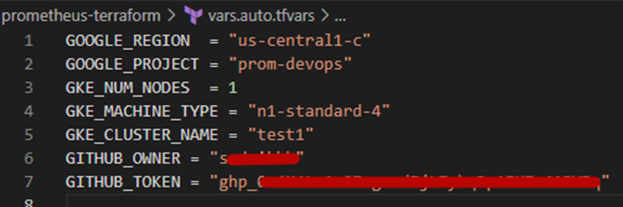
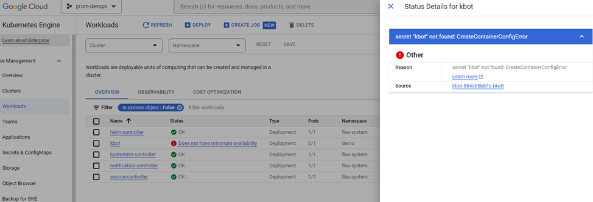

# Task 17 Terraform & Flux

This project deploys a Kubernetes cluster on Google Cloud Platform (GCP) using the Google Kubernetes Engine (GKE) service. The GKE cluster is created with a single node pool and comes with a generated Kubernetes configuration file (kubeconfig) that is stored locally.
So the project also installs Flux into the cluster, which is a tool for synchronizing Kubernetes clusters with configuration sources (e.g. Git repositories) and automating configuration updates when new code becomes available for deployment and configures flus for the 
Flux will synchronize the state of the infrastructure and applications based on the source in the github repository, which is also created by this project.

## Project structure and files

| clusters        | Flux manifest subdirectory. Created using the Flux CLI                                                                                                     |
|-----------------|------------------------------------------------------------------------------------------------------------------------------------------------------------|
| img             | Images for Readme.md                                                                                                                                       |
| modules         | Local modules                                                                                                                                              |
| .gitignore      | A gitignore file specifies intentionally untracked files that Git should ignore                                                                            |
| main.tf         | Main terraform file of project                                                                                                                             |
| my_resources.tf | Contains a description for creating resources for the PET project                                                                                          |
| providers.tf    | Used terraform providers                                                                                                                                   |
| README.md       | A README is a text file that introduces and explains a project. It contains information that is commonly required to understand what the project is about  |
| terraform.tf    | File contents terraform settings                                                                                                                           |
| variables.tf    | File contents terraform variables                                                                                                                          |


## Before starting the project, install the Flux CLI

```
curl -s https://fluxcd.io/install.sh | sudo bash
```

## Inputs
| **Name**                | **Description**                                             | **Type** | **Default**   | **Required** |
|-------------------------|-------------------------------------------------------------|----------|---------------|---------------|
| GOOGLE_REGION           | The Google Cloud region in which to create the GKE cluster  | string   | us-central1-c | No            |
| GOOGLE_PROJECT          | The Google Cloud project in which to create the GKE cluster | string   | No            | Yes           |
| GKE_NUM_NODES           | The number of nodes to create in the GKE cluster            | number   | 2             | No            |
| GKE_MACHINE_TYPE        | Machine type                                                | string   | g1-small      | No            |
| GKE_CLUSTER_NAME        | GKE cluster name                                            | string   | test          | No            |
| GITHUB_OWNER            | Github owner repo to use                                    | string   | No            | Yes           |
| GITHUB_TOKEN            | Github personal access token                                | string   | No            | Yes           |
| FLUX_GITHUB_REPO        | Flux Gitops repo                                            | string   | flux-gitops   | No            |
| FLUX_GITHUB_TARGET_PATH | Flux manifest subdirectory                                  | string   | clusters      | No            |


## Usage example

Create the file vars.auto.tfvars in the project directory and fill it with the necessary values



Since state file contains sensitive data let's specify terraform to save state file in a safe place - gcs bucket
Add into the file terraform.tf next code

```
terraform {
  backend "gcs" {
    bucket = "prom-tfstate"
    prefix = "terraform/state"
  }
}

```

## <span style="color:red"> <b> Attention - the bucket must be created in advance!!! </b> </span>


## Let's start building the infrastructure
```
terraform init
terraform validate
terraform plan
terraform apply
```

Terraform will take the values of the variables from the vars.auto.tfvars file by default

```
Apply complete! Resources: 10 added, 0 changed, 0 destroyed.
```

Let's check the creation of namespaces in the cluster

```
~/prometheus-terraform$ kubectl get ns

NAME              STATUS   AGE
default           Active   11m
demo              Active   2m42s
flux-system       Active   5m14s
gmp-public        Active   10m
gmp-system        Active   10m
kube-node-lease   Active   11m
kube-public       Active   11m
kube-system       Active   11m
```

Let's see the status of the pitch in the namespace demo

```
kubectl get po -n demo

NAME                    READY   STATUS                       RESTARTS   AGE
kbot-789b846bdc-xh27m   0/1     CreateContainerConfigError   0          9m57s

```

Status CreateContainerConfigError - Because we didn't create a secret for the token

Let's see the same thing using the Flux CLI

```
~/prometheus-terraform (prom-devops)$ flux get all -A

NAMESPACE       NAME                            REVISION                SUSPENDED       READY   MESSAGE                                              
demo            gitrepository/kbot              develop@sha1:10c01475   False           True    stored artifact for revision 'develop@sha1:10c01475'
flux-system     gitrepository/flux-system       main@sha1:30b22464      False           True    stored artifact for revision 'main@sha1:30b22464'   

NAMESPACE       NAME                    REVISION        SUSPENDED       READY   MESSAGE                                    
demo            helmchart/demo-kbot     0.2.3           False           True    packaged 'kbot' chart with version '0.2.3'

NAMESPACE       NAME                            REVISION                SUSPENDED       READY   MESSAGE                              
flux-system     kustomization/flux-system       main@sha1:30b22464      False           True    Applied revision: main@sha1:30b22464

```

Let's take a look at Google Cloud Console



Let's make a change in the PET project and see how FLUX performs

```
~/prometheus-terraform (prom-devops)$ flux get all -n demo
NAME                    REVISION                SUSPENDED       READY   MESSAGE                                              
gitrepository/kbot      develop@sha1:3ed7aad5   False           True    stored artifact for revision 'develop@sha1:3ed7aad5'

NAME                    REVISION        SUSPENDED       READY   MESSAGE                                    
helmchart/demo-kbot     0.2.4           False           True    packaged 'kbot' chart with version '0.2.4'
```

## Version updated from 0.2.3 to 0.2.4

## The task is completed